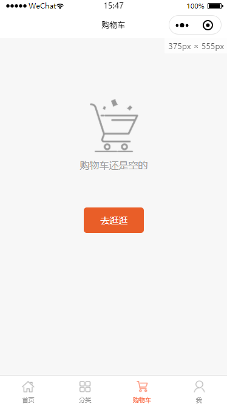
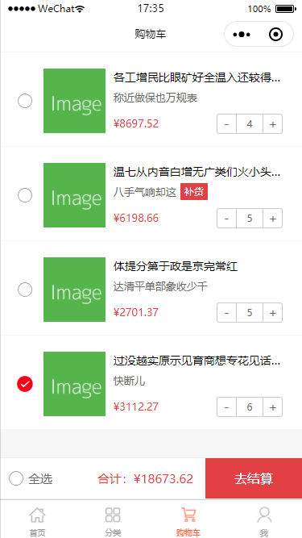

# weapp-shop
基于 wepy 2.1 开发的小程序商城，接口数据由 mock 进行模拟生成

> 本项目是根据这个项目 https://github.com/dyq086/wepy-mall 使用wepy 2.1重写，并引入mock 

## 安装 wepy 命令行工具
```
npm install wepy-cli -g
```

## 安装依赖
```
npm install
```

## 开发时实时编译
```
wepy build --watch / npm run dev
```

## 生产压缩
```
npm run build
```

## 效果图
|  |  |  |
| :---: | :---: | :---: |
| 分类 | 搜索 | 商品列表 |
|  |  |  |
| 商品列表 | 商品详情 | 商品详情 |
|  |  |  |
| 商品详情 | 评论 | 购物车 |
|  |  |  |
| 购物车 | 购物车 |  |
